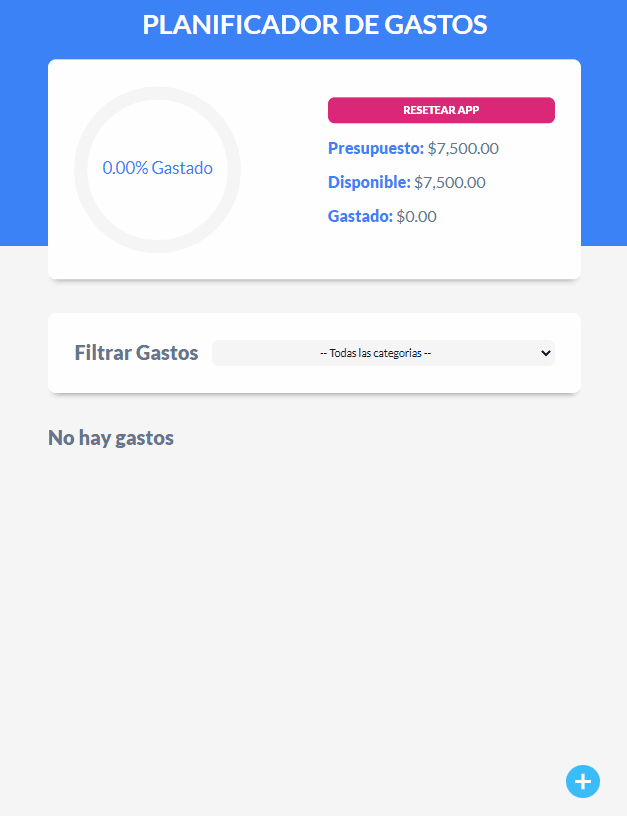

# App de control de Gastos

### `Realizado por Néstor Gomez`

Descripcion del proyecto:
Aplicacion de control de gastos, no utiliza ni context ni redux, se realizo para comprender el pasaje de datos entre componentes mediante props.
- utilización de los hooks useState y useEffect
- Desde un componente padre hacia un componente hijo.
- Desde un hijo hacia un padre, enviando una funcion desde el padre para que la ejecute el hijo y retorne el valor al padre.

Para correr que el proyecto debemos:

- npm run dev

Herramientas utilizadas:

- Vite {React Framework}
- LocalStorage
- react-swipeable-list (para eliminar o editar gastos deslizando hacia derecha o izquierda para cada gasto)
- react-circular-progressbar (para mostrar el grafico de porcentaje del monto disponible gastao)

